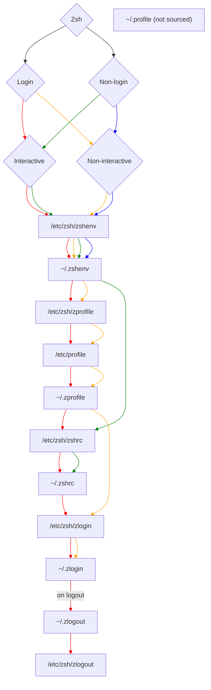
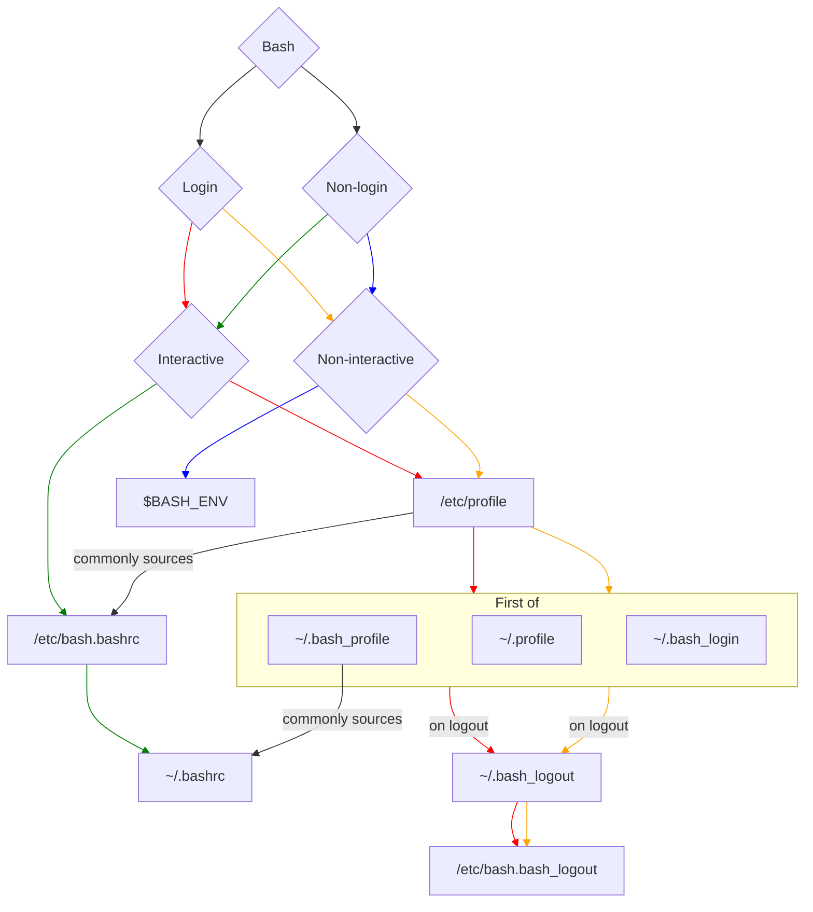

# Dot Files

My dot files.

## Requirements

- `git`
- [`stow`](https://www.gnu.org/software/stow/manual/html_node/)

```shell
sudo apt install git stow 
```

## Stow files

```shell
# Dry run to validate what is being linked
stow -vn --target $HOME .

# Then a real run
stow -v --target $HOME .
```

## Troubleshooting

**issue**: `existing target is neither a link nor a directory: ...`

**resolution**:

```shell
git pull origin main
stow --target $HOME --adopt .
git restore .
```

## Misc

### `zsh` Startup Loading Sequence



### `bash` Startup Loading Sequence



## Additional Reads

- [`neovim` README](.config/nvim/README.md)

